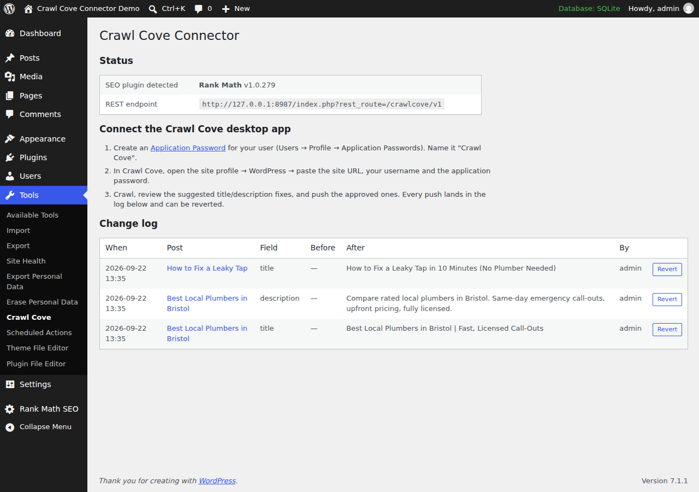

# Crawl Cove Connector — WordPress SEO Plugin for Bulk Title & Meta Description Fixes

The official WordPress companion plugin for [Crawl Cove](https://crawlcove.com), the desktop SEO crawler. Push approved page title and meta description fixes from your SEO audit straight into **Yoast SEO**, **Rank Math**, **SEOPress** or **All in One SEO (AIOSEO)**, with a full change log and one-click revert.

Crawl your site, review the suggested fixes in the app, push the ones you approve. No CSV exports, no spreadsheets, no copy-pasting into the post editor one page at a time.



## Why this plugin exists

Every SEO crawler can find missing, duplicate, too-long or too-short titles and meta descriptions. Almost none of them can fix any of it. The usual workflow is: export a CSV, open each post in the WordPress editor, find the SEO plugin's meta box, paste, save, repeat a few hundred times.

Crawl Cove Connector closes that loop. The [Crawl Cove desktop crawler](https://crawlcove.com) sends the fixes you approved to your site over the WordPress REST API, and this plugin writes them into the native fields of whichever SEO plugin you already use. Nothing is duplicated or overridden at render time; your SEO plugin keeps working exactly as before, just with better values.

## Features

- **Bulk-apply title and meta description fixes** approved in the Crawl Cove app, in batches, with per-item results.
- **Works with the four major WordPress SEO plugins**: Yoast SEO, Rank Math, SEOPress and AIOSEO. The connector detects which one is active and writes its native fields.
- **Full change log with one-click revert**: every write records the previous value. Undo any change from **Tools → Crawl Cove** or from the app.
- **Dry-run mode** shows exactly what would change before anything is written.
- **Authentication via WordPress core Application Passwords**: no extra accounts, no API keys stored by the plugin, revoke access any time from your user profile.
- **Respects WordPress permissions**: a connected user can only change posts they are allowed to edit (`edit_post` checked per post).
- **Private by design**: no external requests, no tracking, no data leaves your site. The plugin only receives what you send it.
- **Small and auditable**: a few hundred lines of GPL PHP, unit- and integration-tested, PHPCS-clean against WordPress-Extra and WordPress-Docs.

## How it works

The plugin registers a REST API under `crawlcove/v1` (auth: WordPress core Application Passwords):

| Route | Method | Purpose |
|---|---|---|
| `/status` | GET | Plugin + detected SEO plugin info |
| `/resolve` | POST | Map crawled URLs to posts, return current title/description |
| `/apply` | POST | Apply a batch of reviewed fixes (`dry_run` supported) |
| `/changes` | GET | The change log |
| `/revert` | POST | Restore a change's previous value |

Safety model:

- Nothing is written that wasn't sent by an authenticated user with the right capability for that specific target: `edit_post` for a post/page, `manage_options` for the homepage, `edit_term` for a taxonomy term.
- Values are sanitized and length-capped; batches are capped at 50 changes.
- Every write records the previous value; revert from the app or from **Tools → Crawl Cove**.
- Empty string means "remove the override, fall back to the SEO plugin's template".
- No external requests, no tracking, no data leaves the site.

### The homepage target (`post_id: 0`)

A site with no static front page set (Settings → Reading → **"Your latest posts"**)
has no post to hold a title/description override for `/` — Yoast and Rank Math each
keep it in their own settings instead. `/resolve` reports the site root as
`post_id: 0` in that case (a static front page still resolves to its own real
post id, exactly like any other page — nothing changes there); pass `post_id: 0`
back to `/apply` or `/revert` to target it.

- **Supported adapters**: Yoast SEO, Rank Math and SEOPress. AIOSEO changes to
  `post_id: 0` fail with `ccc_home_unsupported` — the change is reported, not
  silently dropped. AIOSEO isn't just unresearched: its "homepage" title and
  description read the *same* site-wide template used to fill in every other
  page's title/description, so writing to it to "fix the homepage" would
  silently change titles across the whole site, not just `/`.
- **Capability**: `manage_options`, not `edit_post` — there is no post to check
  `edit_post` against, and Settings → Reading (where this value lives natively)
  already requires it.
- **Rank Math's homepage title cannot be cleared**: unlike every other
  title/description field in this plugin, an empty string sent for Rank Math's
  homepage title is rejected with `ccc_home_title_clear_unsupported` instead of
  being written. Verified against real Rank Math source: its homepage title has
  no fallback template applied at render time (an empty stored value renders as
  a literally empty `<title>` tag), unlike Yoast's homepage title/description and
  Rank Math's own homepage description, which do fall back safely. Set a new
  title instead of clearing it, or clear it from Rank Math's own settings page.
- Sending `post_id: 0` on a site that **does** have a static front page returns
  `ccc_no_homepage_target` — pass that page's own post id instead.

### The taxonomy term target (a negative `post_id`)

A category, tag or custom-taxonomy archive (e.g. `/category/news/`) has no
post to hold a title/description override — Yoast and Rank Math each keep
per-term SEO data in their own storage instead. `/resolve` reports a term
archive URL as `post_id: -$term_id` (term ids are always positive, so a
negative number is unambiguous and free to repurpose — the same trick
`post_id: 0` already uses for the homepage); pass that same negative number
back to `/apply` or `/revert` to target it.

This is deliberately a **per-term** override, not the taxonomy's site-wide
default title *template* (Settings the SEO plugin itself exposes, e.g.
"Category archives" in Yoast's Search Appearance). A template change would
affect every term in that taxonomy at once — wrong for a fix aimed at one
crawled URL — so this plugin never touches it.

- **Supported adapters**: Yoast SEO and Rank Math. SEOPress and AIOSEO
  changes to a term fail with `ccc_term_unsupported` — the change is
  reported, not silently dropped. Both are unresearched for terms (same
  posture the homepage work originally had for all four adapters); a
  future release may add them once their term storage is verified against
  real source the same way Yoast's and Rank Math's was.
- **Capability**: `edit_term`, WordPress core's own meta capability for
  editing a specific term — there is no post to check `edit_post` against.
  It maps through to the term's taxonomy (e.g. `manage_categories` for
  `category`/`post_tag`; a custom taxonomy can register its own capability
  type). Editor-role users have this by default; Author-role users do not.
- Sending a negative `post_id` with no matching term returns `ccc_no_term`.
- Unlike Rank Math's homepage title, clearing a term's title or description
  to `''` is safe for both supported adapters — each falls back to the
  taxonomy's own default title template, verified against real source
  (Rank Math's `Paper\Taxonomy::title()`; Yoast's term-archive indexable
  presentation follows the same pattern as its homepage description).

See [SECURITY-NOTES.md](SECURITY-NOTES.md) for the full security pass (capability matrix, fuzzing, findings).

## Installation

1. Install and activate the plugin on your WordPress site (requires WordPress 6.2+ and PHP 7.4+).
2. Create an Application Password: **Users → Profile → Application Passwords → "Crawl Cove"**.
3. In the [Crawl Cove desktop app](https://crawlcove.com), open your site profile → WordPress and enter the site URL, username and application password.
4. Crawl, review the suggested fixes, push the approved ones. Review or revert them any time under **Tools → Crawl Cove**.

## Frequently asked questions

**Does it work without the Crawl Cove app?**
The plugin is the receiving end; fixes are reviewed and sent from the desktop crawler. The change log and revert work standalone in wp-admin.

**Will it conflict with my SEO plugin?**
No. It writes the same post meta fields your SEO plugin owns (for example Yoast's `_yoast_wpseo_title`), then gets out of the way. There is nothing to keep in sync.

**Can it change content or anything besides SEO fields?**
No. It writes SEO titles and meta descriptions, nothing else, and only for posts the authenticated user can edit.

## Development

```
composer install
composer test     # PHPUnit against lightweight WP stubs (tests/bootstrap.php)
composer lint     # php -l over all plugin files
```

The core logic (`CCC_Service`, `CCC_Adapter`, `CCC_Change_Log`) is deliberately free of `WP_REST_*` types so it unit-tests without a WordPress install. Integration smoke-testing against a real WordPress (all four adapters, plus a security check suite) runs before each release: see `tests/integration/`.

## Releasing

Versions are tagged `vX.Y.Z` on `main`. See [CHANGELOG.md](CHANGELOG.md).

## About Crawl Cove

[Crawl Cove](https://crawlcove.com) is a desktop SEO crawler for auditing sites of any size: broken links, redirects, duplicate content, titles and meta descriptions, structured data and more, with your data staying on your machine.

License: [GPLv2 or later](LICENSE).
